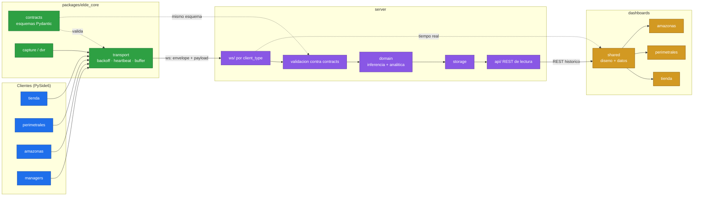

# HITO 2 — Arquitectura objetivo

> Propuesta de estructura final. **No se ha movido ni una linea**: este
> documento se aprueba antes de tocar nada. Generado el 2026-07-30.

---

## 1. De donde partimos

Resumen de lo medido en los HITOS 0 y 1, que es lo que justifica cada decision
de aqui abajo:

| Dato | Cifra | Consecuencia |
|---|---:|---|
| Clientes | 4 | Todos derivan del mismo codigo base |
| LOC totales | 92.612 | Clientes 37.043 · servidor 55.569 |
| Archivos identicos entre clientes | 34 (**3.541 LOC**) | Nucleo compartido evidente |
| Archivos con similitud >= 90% | 136 (~17.700 LOC) | ~48% del codigo cliente |
| Contrato cliente↔servidor | **no existe** | 32 claves con `data.get()` sin validar |
| Base de datos | **no hay** | Persistencia en `.pkl`, JSON y PNG |
| Codigo muerto real | 16 modulos | El problema no es el codigo muerto |
| Hardcode | 218 valores | La IP del servidor esta en los 4 clientes |
| Identidad de camara | **inestable** (H-11) | `uuid4()` por sesion: no hay historico por zona |

**La conclusion que ordena todo el refactor:** el problema de este ecosistema
no es la basura acumulada, es la **duplicacion** y la **ausencia de contrato**.
Por eso el orden de los hitos siguientes es correcto: primero contrato, luego
nucleo, luego clientes.

---

## 2. Principios de diseno

1. **Un solo sitio para cada cosa.** Si un archivo es identico en 2+ clientes,
   pertenece al nucleo. Sin excepciones.
2. **El nucleo no sabe de negocio.** Puede capturar video, hablar con un DVR y
   enviar un evento; no sabe que es un pasillo, una intrusion o una mesa.
3. **El contrato es codigo, no documentacion.** Los esquemas se validan en
   ejecucion y son el mismo archivo en cliente y servidor.
4. **Cero configuracion en el codigo.** IPs, puertos, rutas, umbrales y
   credenciales salen a archivos por cliente, validados al arrancar.
5. **Cada paso es reversible.** Nada de migraciones de una sola pieza.
6. **Lo que funciona y esta afinado no se toca.** El pipeline de vision lleva
   meses de ajuste fino; se envuelve, no se reescribe.

---

## 3. Estructura objetivo

```
ELDE/
├── packages/
│   └── elde_core/                  # instalable: pip install -e packages/elde_core
│       ├── contracts/              # ← HITO 3. Fuente unica de verdad
│       │   ├── envelope.py         #   client_type, site_id, device_id, event_type…
│       │   ├── eventos.py          #   un modelo Pydantic por evento
│       │   └── version.py          #   compatibilidad y migracion de nombres
│       ├── config/                 # carga archivo+entorno, validacion tipada
│       ├── logging/                # formato unico para clientes y servidor
│       ├── transport/              # ws: conexion, backoff, heartbeat, buffer offline
│       ├── capture/                # ventanas Windows, RTSP, control de FPS
│       ├── dvr/                    # Hikvision, Dahua, Hik-Connect, EZVIZ, descubrimiento
│       ├── geometry/               # zonas, poligonos, ROI
│       └── ui/                     # widgets PySide6 comunes (barra, splash, arbol DVR…)
│
├── clients/
│   ├── tienda/                     # hoy tienda_view
│   ├── perimetrales/               # hoy perimetrales-view
│   ├── amazonas/                   # hoy "Amazonas View"
│   └── managers/                   # hoy windows_managers_view
│       ├── config/                 # SU configuracion, nada hardcodeado
│       ├── pipeline/               # lo especifico de su dominio
│       ├── ui/                     # solo su disposicion propia
│       └── main.py
│
├── server/                         # hoy "SERVER-IA PERIMETRALES"
│   ├── api/                        # REST de lectura para los dashboards
│   ├── ws/                         # entrada por client_type
│   ├── domain/                     # inferencia y analitica (se conserva)
│   ├── storage/                    # una sola forma de escribir eventos
│   └── registry/                   # catalogo de sitios y dispositivos
│
├── dashboards/
│   ├── shared/                     # sistema de diseno + capa de datos
│   ├── tienda/  ├── perimetrales/  └── amazonas/
│
├── docs/refactor/
└── _legacy/                        # cuarentena, se vacia en el HITO 10
```

### 3.1 Que va al nucleo, con la evidencia

Cada linea sale de la tabla de duplicados del HITO 1:

| Modulo del nucleo | Archivos que absorbe | Repetido en | LOC |
|---|---|---:|---:|
| `dvr/` | `hikvision_sdk`, `dahua_sdk`, `hikconnect`, `hikvision_http`, `dahua_http`, `context`, `hikconnect_channel_encoder`, `discovery`, `ezviz` | 2–4 clientes | ~1.500 |
| `ui/` | `device_panel`, `interactive_imageLabel`, `dvr_tree`, `modal_msm`, `sidebar_dock`, `window_bar`, `channel_row`, `box_image`, `SplashScreen`, `btn_footer`, `device_list` | 2–4 | ~1.800 |
| `capture/` | `window_controller`, `capture_exaple`, `window_global`, `windows_detector`, `window_capture`, `locking_windows`, `rtsp_worker`, `capture_woker` | 2–4 | ~850 |
| `transport/` | `socket_client`, `jarvis_api`, `dvr_connect_worker` | 3–4 | ~360 |
| `config/` | `settings_model`, `app_singleton` | 3–4 | ~180 |

### 3.2 Criterio explicito: comun vs especifico

**Va al nucleo** si cumple las tres:
1. No menciona conceptos de un dominio concreto (pasillo, intrusion, mesa).
2. Se puede probar sin levantar un cliente entero.
3. Ya esta duplicado, o se sabe que el proximo cliente lo necesitara.

**Se queda en el cliente** si es cierta una:
1. Codifica una regla de negocio (que se detecta, que dispara alerta).
2. Es disposicion visual propia de ese producto.
3. Depende del calendario de entregas de ese cliente en concreto.

**Caso limite resuelto:** `render_box.py` esta duplicado pero mezcla chrome
comun con logica de dominio. **Se parte**: el contenedor y el overlay van al
nucleo; el menu de dominio (zonas de tienda, VLM, planograma) se queda.

---

## 4. Flujo de datos



Lo que cambia respecto a hoy: **`contracts` es el mismo codigo** en los dos
extremos, y todo lo entrante se valida antes de tocar el dominio. Hoy no hay
ninguna de las dos cosas.

---

## 5. Decision sobre los repositorios git

Pregunte dos veces y no hubo respuesta, asi que la resuelvo aqui, que es su
sitio. Situacion actual: la raiz es un repo nuevo y `Amazonas View`,
`SERVER-IA PERIMETRALES`, `perimetrales-view` y `windows_managers_view` estan
dentro como **gitlink** — la raiz apunta a un commit suyo pero no versiona su
contenido. No es un monorepo real.

### 5.1 Los remotos actuales ya estan rotos

Los remotos **si estan vivos** (ultimo push entre el 29-may y el 2-jul-2026),
pero la topologia es incoherente:

| Carpeta local | Remoto configurado |
|---|---|
| `perimetrales-view` | `view.official.git` (origin) **+** `Amazonasview.git` |
| `windows_managers_view` | `view.official.git` (origin) |
| `Amazonas View` | `Amazonasview.git` (origin) |
| `SERVER-IA PERIMETRALES` | `SERVER-IA.git` (origin) |

**Dos carpetas locales distintas y divergentes publican en el mismo repo.**
`perimetrales-view` y `windows_managers_view` tienen las dos su `origin/main`
en `view.official.git`; el que empuje segundo pisa al primero. Y
`Amazonasview.git` es a la vez el origin de `Amazonas View` y un segundo remoto
de `perimetrales-view`. Esto es un problema de hoy, no del refactor
(registrado como H-12).

### 5.2 Decision: absorber y publicar en un remoto nuevo

1. `git bundle create <proyecto>.bundle --all` por subrepo → respaldo completo
   del historial, fuera del arbol.
2. Verificar cada bundle (`git bundle verify`).
3. Tag `pre-absorcion` en la raiz.
4. Eliminar los `.git` anidados.
5. `git add -A` en la raiz: el monorepo pasa a versionar todo de verdad.
6. Publicar el monorepo en **un remoto nuevo** (p. ej. `ELDE-ecosistema`).
   Los tres repos actuales quedan como archivo de solo lectura.

**Por que absorber y no submodulos:** el HITO 4 consiste precisamente en mover
codigo *entre* proyectos. Con submodulos, cada extraccion al nucleo son dos
commits en dos repos mas la actualizacion del puntero, y un `git bisect` que
cruce el limite no funciona. El coste se paga en cada uno de los hitos 4 a 7.

**Por que un remoto nuevo y no conservar los tres:** conservarlos significaria
mantener viva la colision de 5.1. Con uno solo desaparece, y hay un unico sitio
donde publicar el ecosistema.

**Que se pierde:** el historial deja de estar vivo por proyecto (queda en los
bundles y en los repos archivados) y hay que crear un repositorio vacio en
GitHub. No se pierde trabajo: solo hay 1-3 commits sin publicar por repo, y son
los commits de respaldo de este refactor.

---

## 6. Plan de migracion

Cada paso es independiente y reversible. El orden esta elegido para que nada
dependa de algo que aun no existe.

| # | Paso | Hito | Riesgo | Rollback |
|---|---|---|---|---|
| 1 | Bundles + absorcion + remoto nuevo | 2 | **medio** | restaurar desde bundle |
| 2 | **Capturar payloads reales** del websocket en una sesion normal | 3 | nulo | son datos, no codigo |
| 3 | **Arreglar H-11**: `device_id` estable | 3 | medio | revertir el commit |
| 4 | Definir `contracts/` validando contra los payloads del paso 2 | 3 | bajo | nadie lo usa aun |
| 5 | Capa de compatibilidad en el servidor: acepta formato viejo y nuevo | 3 | bajo | quitar la capa |
| 6 | Crear `packages/elde_core` vacio e instalable | 4 | nulo | borrar carpeta |
| 7 | Mover al nucleo lo **identico** (34 archivos, 3.541 LOC) | 4 | bajo | los clientes aun tienen su copia |
| 8 | Reconciliar lo **casi identico** (>=90%) eligiendo una version | 4 | **alto** | por archivo, con diff revisado |
| 9 | Cliente tienda: usar el nucleo + contrato + config | 5 | medio | rama por cliente |
| 10 | Idem perimetrales / amazonas / managers | 6-7 | medio | idem |
| 11 | Servidor: validacion, registro de dispositivos, API de lectura | 8 | medio | la capa de compatibilidad sigue |
| 12 | Dashboards sobre la API | 9 | bajo | los actuales siguen vivos |
| 13 | Vaciar `_legacy/` | 10 | bajo | tag previo |

**El paso 8 es el peligroso.** Los archivos con 90-99% de similitud divergieron
por algo: puede ser un arreglo aplicado en un solo cliente. Cada reconciliacion
exige leer el diff y decidir, nunca «gana el mas nuevo».

### 6.1 Por que H-11 va en el HITO 3 y no mas tarde

El envelope del HITO 3 lleva `device_id` como campo obligatorio: **la identidad
del dispositivo *es* parte del contrato**. Definir el contrato sobre el
`uuid4()` por sesion de H-11 seria formalizar el bug, y obligaria a rehacer
tanto el contrato como su capa de compatibilidad al corregirlo despues.
Arreglarlo cuando todavia no hay nada construido encima cuesta mucho menos.

Ya existe la pieza estable: `_camera_display_name()` resuelve
`alias del canal DVR > titulo de la ventana > "Camara N"`.

### 6.2 Por que capturar payloads es obligatorio

No es una mejora opcional. Es literalmente un criterio de aceptacion del
HITO 3 —«los esquemas validan los payloads reales del sistema actual»— y sin
una captura previa no hay forma de cumplirlo.

Ademas **no existe ni un test en los 5 proyectos**: esos payloads son la unica
red disponible para comprobar en los hitos 5-7 que el comportamiento no
cambio. Por eso van en el paso 2, antes de tocar nada.

---

## 7. Que NO se toca en esta iteracion

| Que | Por que |
|---|---|
| `person_amazona_inference.py` (~3.400 LOC) | Es el pipeline de vision afinado durante meses: perfiles por camara, umbrales de demografia, Re-ID. Se envuelve tras una interfaz, no se reescribe. |
| `vigilante_amazonas/` | Paquete reconstruido entero hace dos semanas; funciona y tiene su propio panel. Entra como esta. |
| Modelos, pesos y TensorRT | No son codigo. Siguen fuera del repositorio. |
| Introducir una base de datos | Cambio grande y ortogonal. Se **evalua** en el HITO 8; hoy la persistencia en archivos funciona. |
| `hik-connect/` (SDK de terceros) | 3954 archivos que no son nuestros. Se documenta de donde salen y se deja fuera. |
| Los 74 paquetes declarados y no usados del servidor | Depurar `requirements.txt` sin poder probar una instalacion limpia es arriesgado. HITO 8. |

---

## 8. Alternativas descartadas

**A. Un unico cliente con modos (`--modo tienda|perimetrales|…`).**
Tentador: eliminaria el 100% de la duplicacion en vez del ~48%. Descartada
**por ahora** porque los cuatro se entregan a clientes distintos, con
calendarios distintos, y hoy viven en dos repos de GitHub separados. Acoplar
sus versiones convierte cualquier entrega en una entrega de los cuatro. Queda
como posible fase posterior, cuando el nucleo ya este consolidado y se vea
cuanto queda realmente de especifico.

**B. Submodulos git.** Ver seccion 5. Descartada salvo que necesites seguir
publicando en los remotos actuales.

**C. Un servidor por tipo de cliente.** Descartada por la evidencia: los cuatro
`.bat` arrancan el mismo `iniciar_servidor_headless.py`. Separarlos triplicaria
la VRAM (los modelos se cargan por proceso) en una maquina con una sola GPU
real.

**D. Reescribir los clientes desde cero.** Descartada: 37.043 LOC con
comportamiento afinado y sin tests. La regla 4 del plan lo prohibe ademas
explicitamente.

**E. Meter base de datos ya (HITO 2).** Descartada como parte de la
reestructuracion: mezcla dos migraciones grandes. Se decide en el HITO 8, con
el requisito de historico de los dashboards ya conocido.

---

## 9. Riesgos abiertos

1. **Sin tests, la equivalencia funcional se comprueba a mano.** No hay suite
   en ninguno de los 5 proyectos. Lo mitiga el paso 2 (captura de payloads),
   pero solo cubre el contrato de red: la UI y el pipeline de vision se siguen
   validando a ojo.
2. **Los venv no aislan** (H-04): `packages/elde_core` instalado con `pip -e`
   puede acabar en el user-site global y afectar a los 4 clientes a la vez.
   Conviene resolver H-04 antes del paso 6.
3. **El paso 8** (reconciliar casi-duplicados) puede revelar que dos clientes
   tienen comportamientos deliberadamente distintos en el mismo archivo.
4. **La absorcion (paso 1) depende de ti**: hay que crear el repositorio vacio
   en GitHub. Hasta entonces el monorepo vive solo en local.
5. **Los datos historicos actuales no sobreviven a H-11.** Los heatmaps y
   conteos acumulados bajo los `uuid4()` viejos no se pueden reasignar a la
   camara real: al estabilizar el `device_id` se empieza a acumular de cero.
   Conviene asumirlo antes del paso 3, no despues.
